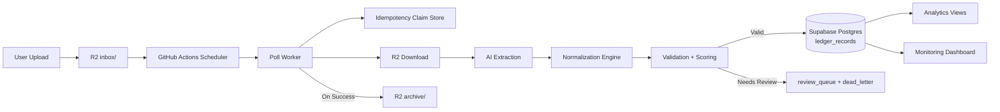
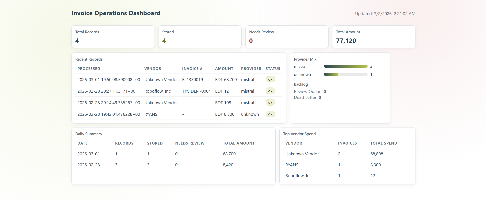

# Invoice Processor

Production-focused AI pipeline for extracting structured data from invoice/receipt files uploaded to Cloudflare R2 and storing validated records in Supabase Postgres.

## Table of Contents

- [Overview](#overview)
- [Current Status](#current-status)
- [Architecture](#architecture)
- [Dashboard](#dashboard)
- [Tech Stack](#tech-stack)
- [Repository Structure](#repository-structure)
- [How It Works](#how-it-works)
- [Setup](#setup)
- [Environment Variables](#environment-variables)
- [Run Locally](#run-locally)
- [GitHub Actions Automation](#github-actions-automation)
- [Supabase Analytics Views](#supabase-analytics-views)
- [Golden Set Evaluation](#golden-set-evaluation)
- [Testing](#testing)
- [Troubleshooting](#troubleshooting)
- [Security Notes](#security-notes)
- [Roadmap](#roadmap)

## Overview

This project automates invoice and receipt processing with a practical production flow:

1. Files are uploaded to `inbox/` in Cloudflare R2.
2. The worker picks files, computes hash, and claims them idempotently.
3. AI extraction runs (Mistral first, optional OpenRouter/Groq fallback).
4. Data is normalized through configurable rules (`config/normalization_rules.json`).
5. Validation and scoring determine `store` vs `review`.
6. Stored records go to Supabase Postgres (`ledger_records`).
7. Processed source files move to `archive/`.

## Current Status

Implemented and working:

- R2 ingestion and archive workflow
- Provider fallback extraction pipeline
- Normalization rule engine (data-driven aliases and parsing rules)
- Validation + scoring + review queue routing
- Postgres ledger storage with duplicate-safe write semantics
- Dead-letter logging and replay tooling
- Scheduled GitHub Actions automation
- Monitoring API + professional web dashboard
- Supabase analytics views for reporting and dashboards

## Architecture



## Dashboard

The project includes a professional dashboard at:

- `http://127.0.0.1:8000/dashboard`

It shows:

- KPI cards (total, stored, needs review, amount)
- Recent records
- Provider mix
- Daily summary
- Top vendor spend
- Active backlog counters
- Review queue inspection, inline JSON edits, and approval for queued items with a stored `normalized_record`

Dashboard preview:



## Tech Stack

- Python 3.11+
- Cloudflare R2 (S3-compatible storage)
- Supabase Postgres
- Mistral API (primary extraction/OCR)
- OpenRouter/Groq (optional fallback)
- FastAPI (monitoring and dashboard)
- Pydantic (schema validation)
- Psycopg (Postgres client)
- Boto3 (R2 client)
- Pytest (tests)
- GitHub Actions (automation)

## Repository Structure

```text
app/
  main.py                 # poll worker entrypoint
  extraction_service.py   # provider clients + fallback
  normalization_engine.py # rules-based coercion engine
  validation.py           # schema + business rule validation
  storage_service.py      # Postgres/Sheets storage adapters
  r2_service.py           # R2 list/download/archive ops
  monitoring_api.py       # /health, /stats, /dashboard
  monitoring_main.py      # dashboard server entrypoint
  dead_letter.py          # dead-letter logging
  replay.py               # replay tooling
  idempotency_store.py    # claim store

config/
  normalization_rules.json

migrations/
  001_analytics_views.sql

tests/
  ... unit + integration tests
```

## How It Works

### 1) Ingestion

- Reads candidate files from `R2_INBOX_PREFIX` (default `inbox/`).
- Filters by supported MIME types.

### 2) Claim & Idempotency

- Downloads file and computes SHA-256 hash.
- Claims (`drive_file_id` + `file_hash`) to avoid duplicate processing.

### 3) Extraction

- Uses `EXTRACTION_PROVIDER=auto` with ordered fallback:
  - `mistral -> openrouter -> groq`
- Provider used is logged and persisted as `used_provider`.

### 4) Normalization

- Data is coerced through `config/normalization_rules.json`.
- Handles common alias patterns across invoice formats.
- Recovers values from OCR text when model output is incomplete.

### 5) Validation

- Pydantic schema checks required structure.
- Business rule checks compute validation score.

### 6) Store or Review

- Valid records are inserted to `ledger_records`.
- Uncertain/invalid records go to review queue and dead-letter logs.

### 7) Archive

- Successfully stored files are moved from `inbox/` to `archive/`.

## Setup

### Prerequisites

- Python 3.11+
- Cloudflare R2 bucket and API credentials
- Supabase project and Postgres connection string
- Mistral API key

### Install

```powershell
pip install -r requirements.txt
```

### Configure Environment

```powershell
Copy-Item .env.example .env
```

Then fill required values in `.env`.

## Environment Variables

Minimum required for R2 + Postgres + Mistral:

- `INGESTION_BACKEND=r2`
- `R2_ENDPOINT_URL`
- `R2_ACCESS_KEY_ID`
- `R2_SECRET_ACCESS_KEY`
- `R2_BUCKET_NAME`
- `R2_INBOX_PREFIX` (default `inbox/`)
- `R2_ARCHIVE_PREFIX` (default `archive/`)
- `LEDGER_BACKEND=postgres`
- `POSTGRES_DSN`
- `POSTGRES_TABLE` (default `ledger_records`)
- `EXTRACTION_PROVIDER=auto`
- `EXTRACTION_PROVIDER_ORDER=mistral,openrouter,groq`
- `MISTRAL_API_KEY`

Recommended:

- `LOG_LEVEL=INFO`
- `ALLOWED_MIME_TYPES=image/jpeg,image/png,application/pdf`
- `NORMALIZATION_RULES_PATH=config/normalization_rules.json`
- `REVIEW_CONFIDENCE_THRESHOLD=0.5`
- `STORE_REVIEW_SCORE_THRESHOLD=0.6`

Optional fallbacks:

- `OPENROUTER_API_KEY`
- `GROQ_API_KEY`

## Run Locally

Process inbox once:

```powershell
python -m app.main poll-once
```

Replay failures/review-required records:

```powershell
python -m app.main replay --status FAILED
python -m app.main replay --status REVIEW_REQUIRED
```

Review queue operations:

```powershell
python -m app.main review-list
python -m app.main review-resolve --document-id <review_document_id>
python -m app.main review-resolve --document-id <review_document_id> --record-path corrected_record.json --note "manual correction"
```

Run monitoring + dashboard:

```powershell
python -m app.monitoring_main
```

## GitHub Actions Automation

Workflow:

- `.github/workflows/poll-once.yml`
- `.github/workflows/golden-eval.yml`
- `.github/workflows/golden-eval-strict-nightly.yml`

Behavior:

- Runs every 15 minutes
- Supports manual trigger (`workflow_dispatch`)
- Uses concurrency lock to prevent overlapping poll jobs
- Golden-set workflow runs on push/PR (for relevant paths) and manual trigger
- Golden-set workflow fails if average evaluation score drops below `0.90`
- Strict nightly workflow runs daily and tracks richer field quality with a `0.75` threshold

Required repository secrets:

- `R2_ENDPOINT_URL`
- `R2_ACCESS_KEY_ID`
- `R2_SECRET_ACCESS_KEY`
- `R2_BUCKET_NAME`
- `R2_INBOX_PREFIX`
- `R2_ARCHIVE_PREFIX`
- `POSTGRES_DSN`
- `POSTGRES_TABLE`
- `MISTRAL_API_KEY`
- `OPENROUTER_API_KEY` (optional)
- `GROQ_API_KEY` (optional)

Quality gate command used in CI:

```bash
python -u -m app.evaluation --dataset eval/golden_set.json --provider auto --model auto --fail-under 0.90
```

## Supabase Analytics Views

Run the SQL in:

- `migrations/001_analytics_views.sql`

Views created:

- `public.ledger_records_flat`
- `public.ledger_line_items_flat`
- `public.ledger_daily_summary`

Quick checks:

```sql
select * from public.ledger_records_flat order by processed_at_utc desc limit 20;
```

```sql
select processing_date, records_total, stored_total, needs_review_total
from public.ledger_daily_summary
order by processing_date desc;
```

## Golden Set Evaluation

Use a fixed dataset to track extraction quality over time.

1. Copy the example file and add your own documents:

```powershell
Copy-Item eval/golden_set.example.json eval/golden_set.json
```

2. Update each case with:
- `file_path`: local path to the invoice/receipt file
- `expected`: normalized target fields (you can provide a subset of fields to score)

3. Run evaluation:

```powershell
python -m app.evaluation --dataset eval/golden_set.json --provider auto --model auto --fail-under 0.80
```

Output:
- Console summary (`cases`, `errors`, `avg_score`, provider mix)
- Full JSON report at `logs/golden_eval_report.json`

This gives you a repeatable quality gate for prompt/rules/provider changes.

Strict benchmark dataset:

- `eval/golden_set_strict.json`

Strict benchmark command (nightly):

```powershell
python -m app.evaluation --dataset eval/golden_set_strict.json --provider auto --model auto --fail-under 0.75 --output logs/golden_eval_strict_report.json
```

## Testing

Run all tests:

```powershell
pytest -q
```

Run integration tests (opt-in):

```powershell
$env:RUN_DRIVE_INTEGRATION_TESTS="1"
pytest -q -m integration
```

## Troubleshooting

- `Found 0 candidate files in r2 inbox`
  - No supported files currently under `inbox/`
  - Or files were already processed/archived by a recent scheduled run

- Dashboard shows `POSTGRES_DSN not configured`
  - Ensure `.env` has `POSTGRES_DSN`
  - Start dashboard via `python -m app.monitoring_main` (loads `.env`)

- Supabase connection errors
  - Use pooler DSN if network is IPv4-only
  - Ensure `sslmode=require`
  - URL-encode special password characters

## Security Notes

- Never commit `.env` or credentials.
- Store production secrets in GitHub Secrets / platform env vars.
- Rotate API keys and DB credentials periodically.
- If secrets are exposed anywhere, rotate immediately.

## Roadmap

- Approval workflow for review queue (approve/reject + replay UX)
- Daily digest notifications (email/Slack)
- Role-based dashboard access
- Additional provider adapters and cost-aware routing
- Export pipelines for BI tools
