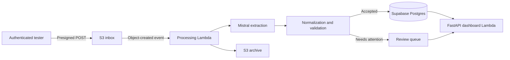

# Ledgerly Invoice Processor

Serverless private-alpha application for turning invoice and receipt files into normalized, reviewable records. The production stack uses AWS Lambda, Amazon S3, Supabase Postgres, and Mistral.

[Open the live application](https://2wuikcntsyyqfgkucq5m26vyfe0kekgl.lambda-url.ap-southeast-1.on.aws/)

## Production flow


```mermaid
flowchart LR
    U[Authenticated tester] -->|Presigned POST| S3[S3 inbox]
    S3 -->|Object-created event| W[Processing Lambda]
    W --> X[Mistral extraction]
    X --> N[Normalization and validation]
    N -->|Accepted| DB[(Supabase Postgres)]
    N -->|Needs attention| Q[Review queue]
    W --> A[S3 archive]
    DB --> UI[FastAPI dashboard Lambda]
    Q --> UI
```

The web Lambda authorizes uploads and returns a five-minute S3 policy. The browser sends the file directly to the private bucket, so document bytes do not pass through the web function. An S3 event invokes the worker, which validates the file, extracts fields, stores the result, and moves the source object to `archive/`.

## Guardrails

- Private tester accounts with secure, HTTP-only sessions
- Maximum 10 active testers and 20 authorized documents per tester
- Maximum 5 MB and 5 pages per document
- Global limit of 1,000 page-processing attempts
- Blocked S3 public access and TLS-only bucket policy
- One-day abandoned-upload cleanup and 30-day archive retention
- Seven-day Lambda log retention
- Annual AWS budget alerts

## Repository map

```text
app/
  monitoring_api.py       FastAPI UI and authenticated API
  serverless_worker.py    S3-event document worker
  extraction_service.py   Model extraction and PDF text enrichment
  normalization_engine.py Field normalization and recovery
  validation.py           Schema and business-rule validation
  alpha_store.py          Tester, session, quota, and job persistence
  object_storage_service.py
  lambda_handlers.py
config/                   Normalization rules
eval/                     Golden evaluation datasets
infra/                    GitHub OIDC bootstrap stack
migrations/               Ordered Supabase/Postgres migrations
schemas/                  Invoice data model
tests/                    Unit and API tests
template.yaml             AWS SAM application
Dockerfile                Lambda container image
```

## Local setup

Requires Python 3.13.

```powershell
python -m venv .venv
.venv\Scripts\Activate.ps1
pip install -r requirements.txt
Copy-Item .env.example .env
```

Fill in the S3, Supabase, and Mistral values in `.env`, then apply the database migrations:

```powershell
python -m app.db_migrate
```

Start the application:

```powershell
python -m app.monitoring_main
```

Open `http://localhost:8000/`.

## Tester administration

Run these commands only from a trusted machine with `POSTGRES_DSN` configured:

```powershell
python -m app.alpha_admin create --username tester.one
python -m app.alpha_admin list
python -m app.alpha_admin disable --username tester.one
python -m app.alpha_admin enable --username tester.one
python -m app.alpha_admin reset --username tester.one
```

Generated passwords are printed once. Do not commit them or place them in deployment variables.

## Testing and evaluation

Run the complete test suite:

```powershell
pytest -q
```

Run the standard golden-set quality gate:

```powershell
python -m app.evaluation --dataset eval/golden_set.json --provider auto --model auto --fail-under 0.90
```

Run the strict benchmark:

```powershell
python -m app.evaluation --dataset eval/golden_set_strict.json --provider auto --model auto --fail-under 0.75 --output logs/golden_eval_strict_report.json
```

## Deployment

Infrastructure is declared in `template.yaml` and deployed by `.github/workflows/deploy-aws.yml` using GitHub OIDC. Follow [AWS_DEPLOYMENT.md](AWS_DEPLOYMENT.md) for the one-time IAM, SSM, database, and repository-variable setup.

The deployment creates:

- A web Lambda with a Function URL
- An S3-triggered worker Lambda
- A private S3 bucket with encryption and lifecycle rules
- Two seven-day CloudWatch log groups
- An annual AWS cost budget

## CI workflows

- `deploy-aws.yml` — tests, validates the SAM template, builds, deploys, and checks `/health`
- `golden-eval.yml` — quality gate for extraction-related changes
- `golden-eval-strict-nightly.yml` — scheduled strict benchmark

## Security notes

- `.env`, tester credentials, database passwords, and model keys must never be committed.
- Production secrets are loaded from SSM SecureString parameters.
- The S3 bucket is private; the web Lambda can authorize inbox uploads, while the worker has only the object permissions required to process and archive them.
- Supabase browser roles are denied direct access to operational tables by the ordered migrations.
