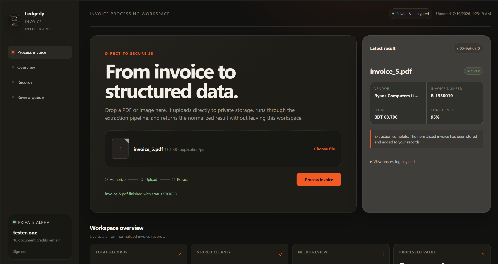
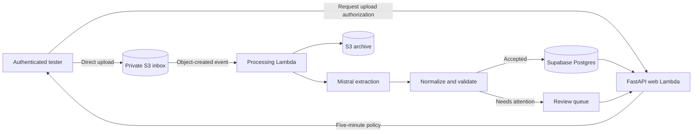

<div align="center">
  

  <h1>Ledgerly Invoice Processor</h1>

  <p><strong>Turn invoices and receipts into structured, reviewable records through a secure serverless workflow.</strong></p>

  <p>
    <a href="https://2wuikcntsyyqfgkucq5m26vyfe0kekgl.lambda-url.ap-southeast-1.on.aws/">
      
    </a>
  </p>

  <p>
    
    
    
    
    
  </p>
</div>

---

Ledgerly is a private-alpha invoice processing application built for a small, controlled group of testers. Users upload PDF, PNG, or JPEG documents directly to a private Amazon S3 bucket; an event-driven worker extracts fields, normalizes and validates the result, and stores structured records in Supabase Postgres.

## Product preview

<div align="center">
  <a href="https://2wuikcntsyyqfgkucq5m26vyfe0kekgl.lambda-url.ap-southeast-1.on.aws/">
    
  </a>
  <sub>Secure entry point to the private-alpha invoice processing workspace.</sub>
</div>

## Highlights

- Direct browser-to-S3 uploads using short-lived presigned policies
- Event-driven processing with separate web and worker Lambda functions
- Mistral-powered extraction with native PDF text enrichment
- Normalization and recovery for invoice numbers, amounts, currencies, dates, and line items
- Schema validation, business-rule checks, confidence scoring, and human review routing
- Searchable records, activity feed, processing status, and review tools in one responsive dashboard
- Individual tester accounts with secure sessions and document quotas
- Idempotent processing and duplicate-safe database writes
- Infrastructure as code, least-privilege IAM, short log retention, and an annual AWS budget

## Architecture


```mermaid
flowchart LR
    USER[Authenticated tester] -->|Request upload authorization| WEB[FastAPI web Lambda]
    WEB -->|Five-minute policy| USER
    USER -->|Direct upload| INBOX[(Private S3 inbox)]
    INBOX -->|Object-created event| WORKER[Processing Lambda]
    WORKER --> EXTRACT[Mistral extraction]
    EXTRACT --> NORMALIZE[Normalize and validate]
    NORMALIZE -->|Accepted| DB[(Supabase Postgres)]
    NORMALIZE -->|Needs attention| REVIEW[Review queue]
    WORKER --> ARCHIVE[(S3 archive)]
    DB --> WEB
    REVIEW --> WEB
```

Document bytes bypass the web Lambda. The browser uploads directly to S3, reducing web-function duration and keeping the application practical for a tightly budgeted alpha.

## Processing lifecycle

1. A tester signs in and selects a supported document.
2. The API checks account and document limits, creates a processing job, and returns a presigned S3 policy.
3. The browser uploads the file directly to the private `inbox/` prefix.
4. S3 invokes the worker Lambda.
5. The worker verifies file size, signature, MIME type, and PDF page count.
6. Extraction, normalization, validation, and scoring run in sequence.
7. The result is stored or routed to review, and the source document moves to `archive/`.
8. The dashboard polls the job and presents the completed structured record.

## Technology

| Layer | Technology | Responsibility |
| --- | --- | --- |
| Web application | FastAPI, Mangum, AWS Lambda | Authentication, dashboard, upload authorization, job status |
| Object storage | Amazon S3 | Private inbox, event trigger, short-lived archive |
| Processing | Python 3.13, AWS Lambda | File inspection, extraction pipeline, validation |
| AI extraction | Mistral AI | Invoice and receipt field extraction |
| Database | Supabase Postgres | Users, sessions, jobs, records, reviews, analytics |
| Infrastructure | AWS SAM, CloudFormation | Repeatable serverless provisioning |
| Delivery | GitHub Actions, GitHub OIDC | Tests, image build, deployment, health check |
| Quality | Pytest, Ruff, golden datasets | Regression and extraction-quality checks |

## Private-alpha guardrails

| Control | Current limit |
| --- | ---: |
| Active testers | 10 |
| Documents per tester | 20 |
| Maximum upload size | 5 MB |
| Maximum PDF length | 5 pages |
| Global page-processing attempts | 1,000 |
| Presigned upload lifetime | 5 minutes |
| Abandoned inbox retention | 1 day |
| Archived document retention | 30 days |
| Lambda log retention | 7 days |

The S3 bucket blocks public access, enforces TLS, and encrypts objects at rest. Production secrets are loaded from AWS Systems Manager Parameter Store.

## Project structure

```text
app/
  monitoring_api.py        FastAPI UI and authenticated API
  serverless_worker.py     S3-event processing worker
  extraction_service.py    Model extraction and PDF text enrichment
  normalization_engine.py  Field normalization and recovery
  validation.py            Schema and business-rule validation
  alpha_store.py           Users, sessions, quotas, jobs, and results
  object_storage_service.py
  lambda_handlers.py
assets/                     Product icon and dashboard screenshot
config/                     Data-driven normalization rules
eval/                       Standard and strict golden datasets
infra/                      GitHub OIDC bootstrap stack
migrations/                 Ordered Supabase/Postgres migrations
schemas/                    Invoice data model
tests/                      Unit, API, storage, and worker tests
template.yaml               AWS SAM application
Dockerfile                  Lambda container image
```

## Local development

### Requirements

- Python 3.13
- An AWS account and private S3 bucket
- A Supabase Postgres project
- A Mistral API key

### Setup

```powershell
python -m venv .venv
.venv\Scripts\Activate.ps1
pip install -r requirements.txt
Copy-Item .env.example .env
```

Configure `.env` with the required values:

```dotenv
INGESTION_BACKEND=s3
S3_BUCKET_NAME=your-private-bucket
S3_REGION=ap-southeast-1

LEDGER_BACKEND=postgres
POSTGRES_DSN=postgresql://...

EXTRACTION_PROVIDER=mistral
MISTRAL_API_KEY=...
```

Apply the ordered database migrations:

```powershell
python -m app.db_migrate
```

Start the application:

```powershell
python -m app.monitoring_main
```

The local dashboard is available at `http://localhost:8000/`.

## Tester administration

Run account-management commands only from a trusted machine with `POSTGRES_DSN` configured:

```powershell
python -m app.alpha_admin create --username tester.one
python -m app.alpha_admin list
python -m app.alpha_admin disable --username tester.one
python -m app.alpha_admin enable --username tester.one
python -m app.alpha_admin reset --username tester.one
```

Generated passwords are shown once. Do not commit them or store them in deployment variables.

## Testing

Run the unit and API suite:

```powershell
pytest -q
```

Run static checks:

```powershell
ruff check app tests
```

Run the standard extraction-quality gate:

```powershell
python -m app.evaluation --dataset eval/golden_set.json --provider auto --model auto --fail-under 0.90
```

Run the strict benchmark:

```powershell
python -m app.evaluation --dataset eval/golden_set_strict.json --provider auto --model auto --fail-under 0.75 --output logs/golden_eval_strict_report.json
```

## Deployment

The application is declared in `template.yaml` and deployed through `.github/workflows/deploy-aws.yml` using GitHub OIDC—no long-lived AWS keys are stored in the repository.

The stack provisions:

- A web Lambda with a public Function URL and application-level authentication
- An S3-triggered processing Lambda
- A private encrypted S3 bucket with lifecycle rules
- Two CloudWatch log groups with seven-day retention
- An annual AWS cost budget with threshold and forecast alerts

Follow [AWS_DEPLOYMENT.md](AWS_DEPLOYMENT.md) for the one-time AWS, SSM, Supabase, IAM, and repository-variable setup.

## Continuous integration

| Workflow | Purpose |
| --- | --- |
| `deploy-aws.yml` | Runs tests, validates SAM, builds Lambda images, deploys, and checks `/health` |
| `golden-eval.yml` | Runs the standard extraction-quality gate for relevant changes |
| `golden-eval-strict-nightly.yml` | Runs the scheduled strict benchmark |

## Security

- Never commit `.env`, tester credentials, database passwords, or model keys.
- Production secrets are stored as SSM `SecureString` parameters.
- Supabase browser roles have no direct access to operational tables.
- The web Lambda can authorize inbox uploads but cannot process archive objects.
- The worker receives only the object permissions required to process and archive documents.
- Session cookies are secure, HTTP-only, and use `SameSite=Lax`.

---

<div align="center">
  Built as a cost-controlled private alpha on AWS.
</div>
